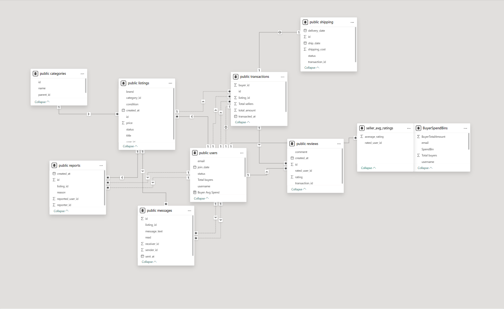

# 🌿 C2C Fashion Marketplace (SQL + Analytics Project)

A full-stack, data-driven simulation of a consumer-to-consumer fashion resale platform, inspired by **Vinted**. This project demonstrates SQL mastery, trust-system logic, data modeling, and business analytics, all backed by realistic data generated with Python.

---

## 🔧 Technologies Used

* **PostgreSQL**: Relational database and query engine
* **Python** (`Faker`, `psycopg2`, `tqdm`): Synthetic data generation
* **SQL**: Advanced queries with joins, aggregates, CTEs, and window functions
* **(Optional)** Power BI: Visual dashboards for insights

---

## 💡 Project Objectives

* Model the core data structures behind a second-hand fashion platform
* Generate realistic sample data (users, listings, transactions, messages, reviews, reports)
* Write advanced SQL queries to extract insights & detect fraud
* Simulate trust/rating systems for marketplace moderation

---

## 📂 Folder Structure

```
C2C-fashion-marketplace-sql/
├── generate_data.py         # Python script to populate the DB with realistic data
├── schema.sql               # PostgreSQL table creation script
├── queries/
│   └── insights.sql         # Business logic & analytical SQL queries
├── ERD.png                  # Database schema diagram
├── visuals/                 # Power BI exports (optional)
│   └── dashboard.png
└── README.md                # Project overview and usage instructions
```

---

## 🔍 Highlights from `insights.sql`

| Query Objective                            | SQL Concepts Showcased                |
| ------------------------------------------ | ------------------------------------- |
| Top sellers by volume and average rating   | Joins, aggregates, `AVG()`, `COUNT()` |
| Detect suspicious users (reports + rating) | `HAVING`, filters, subqueries         |
| Revenue trend per category over time       | `DATE_TRUNC()`, `GROUP BY`            |
| Listings that never sold                   | `LEFT JOIN`, null filtering           |
| Message → Sale conversion rate             | CTEs, deduplication, nested selects   |
| Seller shipping performance                | Date math, grouping, averages         |

---

## 👁️ ER Diagram



*(Includes Users, Listings, Transactions, Reviews, Reports, Messages, Shipping, and Categories)*

---

## 🌐 How to Use

1. Create a PostgreSQL database: `fashion_marketplace`
2. Run `schema.sql` to create the schema
3. Run `generate_data.py` to populate the database with fake data
4. Use `queries/insights.sql` to run analytical queries
5. *(Optional)* Export results to CSV and load into Power BI

---

## 🚀 Real-World Applications

* Simulates how C2C platforms like **Vinted**, **Depop**, or **Poshmark** manage trust, ratings, fraud, and marketplace health
* Demonstrates strong SQL fundamentals and advanced analytics
* Ready for inclusion in a **data analytics or data engineering portfolio**

---

## 🎓 Author

Built by Edgaras as part of a portfolio to showcase skills in:

* Data modeling and pipelines
* Marketplace logic
* Business intelligence and fraud detection

> If you're hiring for a data role or just curious, feel free to reach out!
